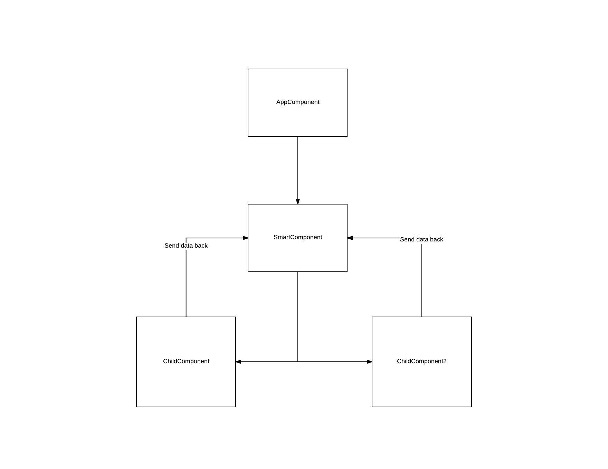

# Complex Angular components
Welcome to lesson 4!

## Angular CLI
We've been writing everything from scratch for a while, and while it's great for small apps, it's not enough when we're trying to write more complex applications. 
This is why we bring in `angular-cli`. The CLI is a `command-line-interface` that can automatically generate an angular app and components.
It'll make our life a lot easier.

### Installation
`npm install -g angular-cli # sudo for *nix`

### Commands
`ng new project-name # generates new project`
`ng g component component-name # generates components`
`ng serve # Builds and serves your project`
`ng build # Builds your project and outputs to dist directory`

### New Project
Create a new project by typing `ng new villain-project`
`ng serve`

## Two-Way Bindings
Remember how we said we could have one-way bindings? We can have two-way bindings as well!
Create a new component called `villain-home`
`ng g component vilain-home`

Let's add the title saying: `List of villains` to the template.

We want to be able to add a new hero using an input box. That's great, but what if we want to bind to the component as we type?
Easy. We use Two-Way Bindings.

We use a `directive` called `NgModel`. A directive is something that allows you to manipulate the original behavior of an element. `NgModel` is what allows us to connect the input box to the component class.
In your component template, add `<input [(ngModel)]="villainName">`

Also, don't forget to add `<app-villain-home></app-villain-home>` to your `AppComponent`'s template.

## On Click
We now want to submit the new villain name to the list of villains. We need a button to do this. Let's talk about On-Click events.

1. Add a button to your villain-home component
2. Add `(click)="addVillain()"` as an attribute to your button
3. Add the `addVillain` method to your `VillainHomeComponent`
4. Create a list of villains in your `VillainHomeComponent`
5. Create a member variable `villainName` to your `VillainHomeComponent` class
6. Add the `villainName` to your list of villains

```typescript
/* villain-home.component.ts */
export class VillainHomeComponent implements OnInit {
  villainName: string;
  villains: string[] = [];
  constructor() { }

  ngOnInit() {
  }
  addVillain() {
    this.villains.push(this.villainName);
    console.log(this.villains);
  }
}
```
```html
<!--villain-home.component.html-->
<input [(ngModel)]="villainName">
<button (click)="addVillain()">Add Villain</button>
```
## Scope 
What if we put the button inside the `AppComponent`? Would it work?
Let's try:
```typescript
<h1>
  {{title}}
</h1>
<app-villain-home></app-villain-home>
<button (click)="addVillain()">Add Villain</button>
```
We get an error! `_co.addVillain is not a function`

This is because each component, regardless of its location, has its own scope and cannot access anything outside of it, unless that data is manually passed to the component.

How do we pass data to the component?

## Angular 4 architecture
We have Smart Components and Dummy Components. Smart Components send information to Dummy Components. Dummy Components take that data, and do something to it, then send the data back.

An example would be a TodoList. We'd have a component for adding the todos, a component to list the todos and then a smart component to contain both of these, the TodoList component. The TodoList component's job is to get the initial data (from somewhere) and then send that info to the list of todos component. It's also supposed to get the new data from AddTodo's component and then send that updated list to the todos component.

Visualized:


## Sending data from parent to child component
This is actually relatively simple.
In your component that's going to receive the data, add `@Input villains: string[]`
Then, in the parent component (that will be sending the data), add the following:
`<app-villain-home [villains]="villainData"></app-villain-home>`
where `villainData` will be data defined in your parent component.

```typescript
/*AppComponent*/
export class AppComponent {
  ...
  initialVillains = ['Darth Vader', 'Boba Fett'];
}
```
```html
<!--app.component.html-->
<app-villain-home [villains]="initialVillains"></app-villain-home>
```
```typescript
export class VillainHomeComponent implements OnInit {
  villainName: string;
  @Input() villains: string[]; //data received by parent component
  constructor() { }
  ...
}
```
